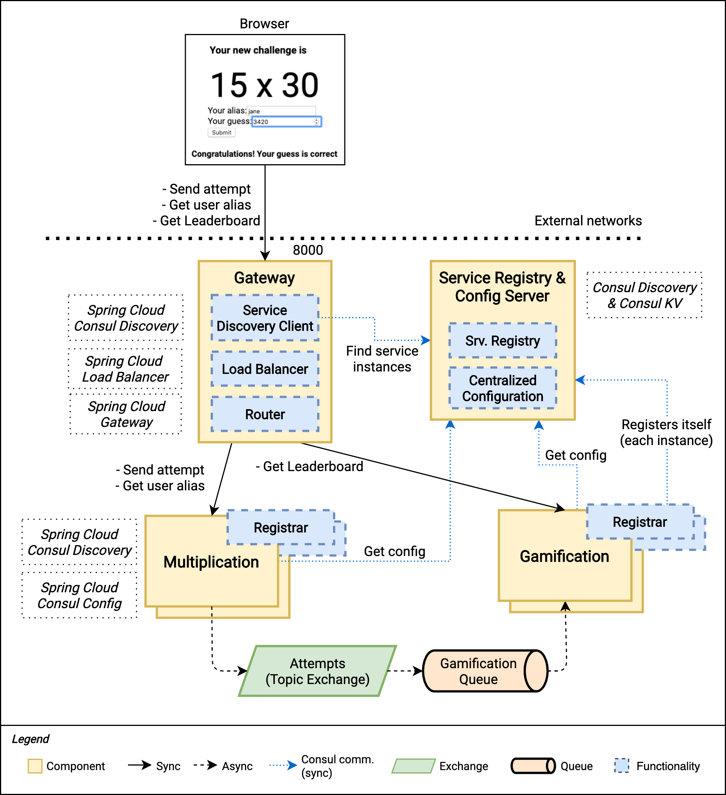

# Gaming Microservices App with Spring Boot 3

A full stack gaming application with Spring Boot, react

The figure below shows a high-level overview of the final version of our system.



## Running the app

```bash
docker$ docker-compose -f docker-compose-public.yml up
```

In case you want to learn how to build the images, keep reading the instructions below.

### Building the images yourself

First, build the application images with:

```bash
multiplication$ ./mvnw spring-boot:build-image
gamification$ ./mvnw spring-boot:build-image
gateway$ ./mvnw spring-boot:build-image
logs$ ./mvnw spring-boot:build-image
```

Then, build the consul importer from the `docker/consul` folder:

```bash
$ consul agent -node=learnmicro -dev
docker/consul$ consul kv export config/ > consul-kv-docker.json
docker/consul$ docker build -t consul-importer:1.0 .
```

And the UI server (first you have to build it with `npm run build`):

```bash
challenges-frontend$ npm install
challenges-frontend$ npm run build
challenges-frontend$ docker build -t challenges-frontend:1.0 .
```

Once you have all the images ready, run:

```bash
docker$ docker-compose up
```

See the figure below for a diagram showing the container view.


Once the backend and the frontend are started, you can navigate to `http://localhost:3000` in your browser and start resolving multiplication challenges.

## Playing with Docker Compose

After the system is up and running, you can quickly scale up and down instances of both Multiplication and Gamification services. For example, you can run:

```bash
docker$ docker-compose up --scale multiplication=2 --scale gamification=2
```

And you'll get two instances of each of these services with proper Load Balancing and Service Discovery.
